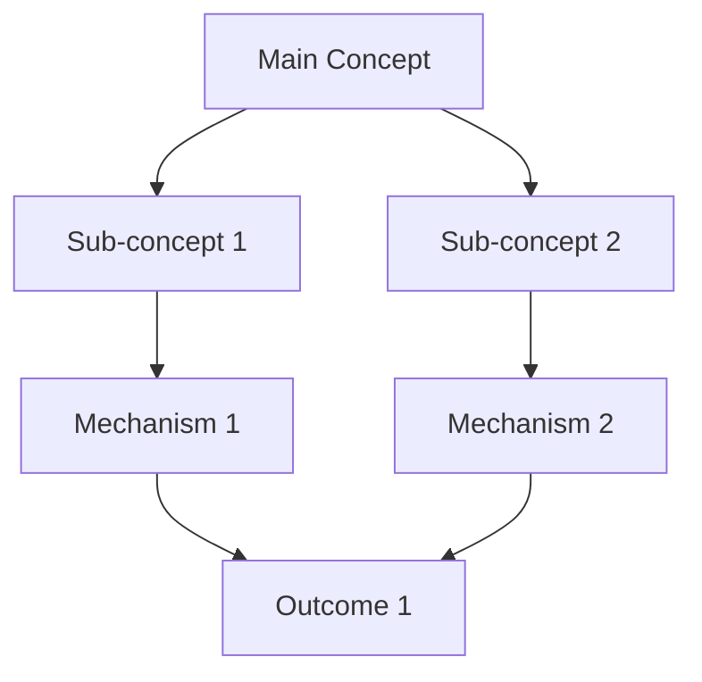

# Deep Research Report: {{title}}

## Executive Brief

*[800-1200 word synthesis of key findings, clinical implications, and research gaps]*

### Key Takeaways
- **Primary Finding**: 
- **Clinical Implication**: 
- **Research Gap**: 

### Context & Significance

### Methodological Considerations

## Key Claims

*Each claim must link to supporting source notes*

### Claim 1: 
**Evidence**: [[Source - Author (Year)]]
**Confidence**: High/Medium/Low
**Contradictions**: None/See limitations

### Claim 2: 
**Evidence**: [[Source - Author (Year)]]
**Confidence**: High/Medium/Low
**Contradictions**: None/See limitations

## Concept Map

## Intervention Table

| Protocol | Target Population | Evidence Quality | RCT Support | Duration | Clinical Notes |
|----------|------------------|------------------|-------------|----------|----------------|
| | | | | | |
| | | | | | |

## Limitations & Uncertainties

### Research Limitations
- **Sample Bias**: 
- **Methodological Issues**: 
- **Replication Status**: 

### Conflicting Evidence
- **Area of Disagreement**: 
- **Competing Theories**: 
- **Unresolved Questions**: 

### Clinical Cautions
- **Contraindications**: 
- **Individual Differences**: 
- **Implementation Challenges**: 

## Sources Overview

*Auto-generated links to source notes*

### High-Quality Sources (n=0)
- [[Source - ]]

### Mixed-Quality Sources (n=0)
- [[Source - ]]

### Supporting Sources (n=0)
- [[Source - ]]

## Change Log

### {{date}} - Initial Report
- Sources analyzed: 0
- Claims documented: 0
- Quality score: 0/100

---

**Research Completed**: {{date}}
**Next Review**: {{next_review_date}}
**Topic Hub**: [[{{topic}}]]